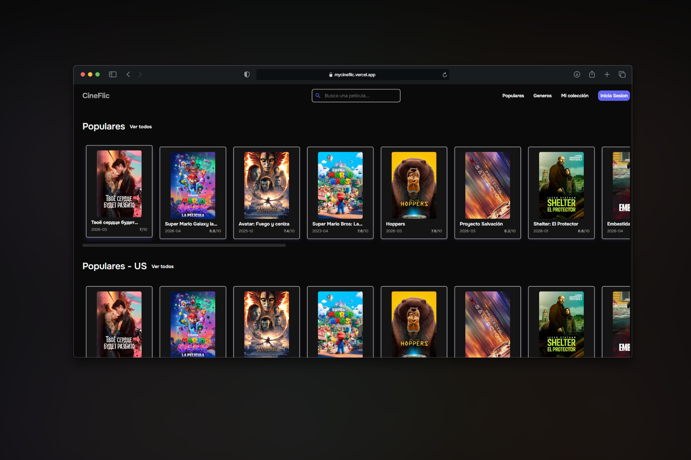
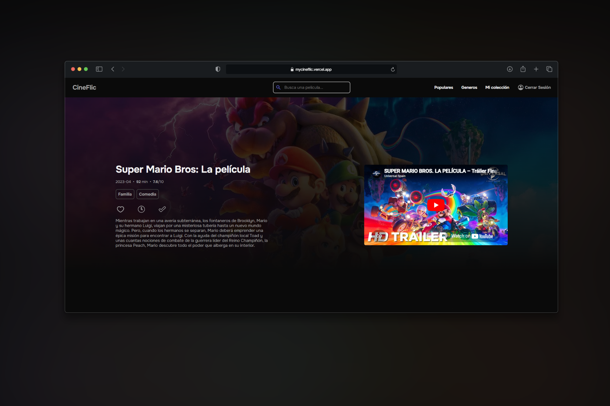
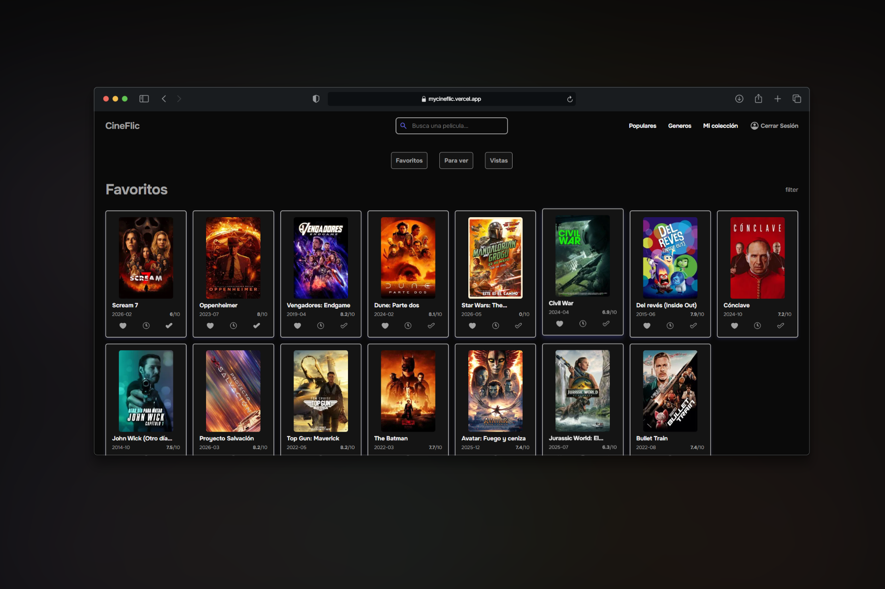

# 🎬 CineFlic

**CineFlic is a movie discovery web app that lets you explore popular films, search by genre, watch trailers, and manage your personal collection.**

🌐 **Live demo:** [mycineflic.vercel.app](https://mycineflic.vercel.app)

---

## Screenshots

### Home



### Movie detail



### Personal collection



---

## Features

- 🔍 **Search** — find any movie with real-time search and debounce
- 🎭 **Browse by genre** — filter movies by category
- 🌍 **Regional popular** — discover what's trending in your country
- 🎬 **Movie detail** — overview, trailer, cast, release date and rating
- ❤️ **Favorites** — save movies to your personal lists (requires login)
- 🕐 **Watchlist** — keep track of what you want to watch
- ✅ **Watched** — mark movies as seen
- 🔐 **Authentication** — sign up and log in with email and password

---

## Tech stack

| Area            | Technology         |
| --------------- | ------------------ |
| Frontend        | Vue 3 + TypeScript |
| Routing         | Vue Router         |
| Auth & Database | Supabase           |
| Movie data      | TMDB API           |
| Deploy          | Vercel             |

---

## API

Movie data is provided by [TMDB](https://www.themoviedb.org/).

> This application uses TMDB and the TMDB APIs but is not endorsed, certified, or otherwise approved by TMDB.

---

## Getting started

```bash
# Install dependencies
npm install

# Set up environment variables
cp .env.example .env
# Add your TMDB and Supabase keys

# Run development server
npm run dev
```

### Environment variables

```env
VITE_TMDB_API_TOKEN=your_tmdb_token
VITE_TMDB_API_KEY=your_tmbd_api_key
VITE_SUPABASE_URL=your_supabase_url
VITE_SUPABASE_ANON_KEY=your_supabase_anon_key
```

---

## Author

**Oriol Plazas León** — DAW Student
